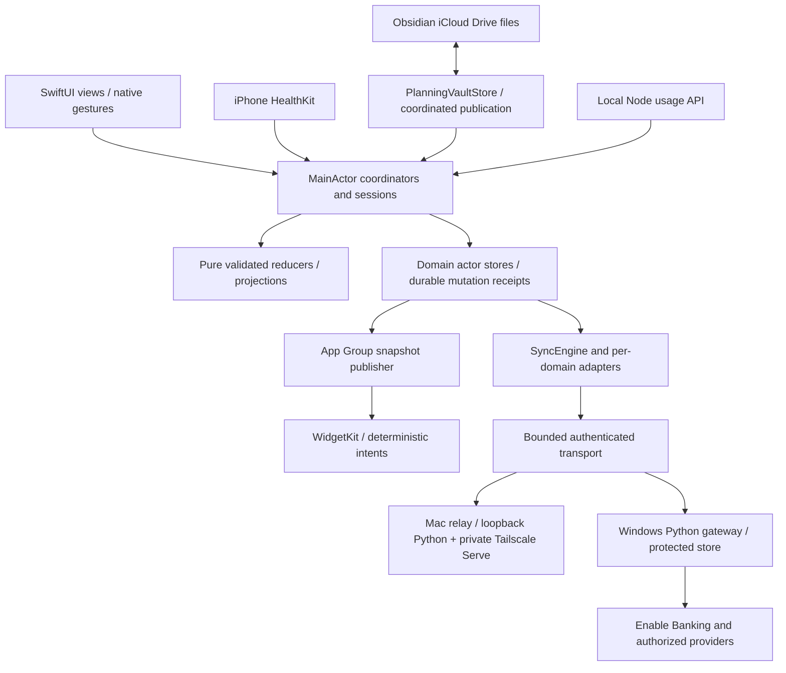

# Target architecture and outage behavior
## Layers

UI never performs persistence/networking from body, Canvas frame, gesture update or animation callback.
Actors isolate I/O; immutable Sendable DTOs cross tasks; MainActor publishes only final revisions/drafts.
Existing snapshots/stores remain authoritative; transport journal is a retransmittable spool, not a competing domain database.
New app transport code lives in ios/Sync, explicitly included in both app targets and neither widget.
Shared contains pure contracts and existing stores; future target membership must avoid loading relay tasks in extensions.

## Topology
Windows remains canonical provider gateway and durable replica; it need not be online for local saves.
Mac runs an optional user LaunchAgent relay while logged in, using a pinned Python environment and a small dedicated ASGI entrypoint.
Reuse pure replication module on Mac/Windows, not Windows ctypes launcher or bank-secret loading on Mac.
Mac relay binds 127.0.0.1:8422 only; private Tailscale Serve exposes the exact registered Mac HTTPS origin.
No Funnel, LAN listener, arbitrary host suffix trust, embedded bank key, browser auth or remote executable adapter.
Mac and iPhone each authenticate relay operations with enrolled device keys; relay responses are also signed.
Thus forged localhost Serve headers alone cannot admit data; do not port Windows identity-header trust to Mac.
Windows retains its existing Serve/OS-owner/edge-capability gate in addition to new device signatures.
Local Node :8787 stays loopback; relay exposes only bounded Usage observation DTOs when explicitly wired.
Mac relay is an opaque transport replica, not a headless copy of Swift domain logic.
Mac app must be running to apply operations to its domain stores; relay may durably hold them while app is closed.
iPhone synchronizes when foregrounded, on explicit refresh, and opportunistically in granted background time.
Mac sleeping/offline or iPhone suspended means local-only operation. Tailscale connectivity cannot bypass iOS suspension.
“Saved on iPhone”, “Synced with Mac”, “Waiting for Windows”, and conflicts are distinct states.

## Protocol v1
SyncOperation: schemaVersion, datasetID, membershipEpoch, domain, entityID, mutationID(UUID),
originDeviceID, originSequence(UInt64), causalParents[mutationID], baseEntityVersion,
operationKind, payloadSchema, payloadBytes, payloadSHA256, signature.
Logical sequence + explicit causal parents determine order; wallTime is diagnostic only.
BaseEntityVersion is the hash of accepted parents/state. Concurrent branches retain both values.
Sequence persisted with operation; never reuse after restart; overflow refuses mutation.
Dataset separates user installations; epoch separates membership changes; max 8 enrolled devices.
max request 1 MiB, 128 operations/page, 64 KiB inline op; larger allowed domain files use bounded content-addressed blobs.
Planning keeps its stricter per-document limits and 32 MiB aggregate; requests never load an entire vault.
Transport spool max 256 MiB or 50,000 pending ops; do not evict pending data to meet cap.
Reserve 32 MiB emergency metadata capacity; surface storage-blocked before accepting new edits if durability cannot be guaranteed.
These are transport limits; stricter existing domain limits win.

## Authentication
Generate Curve25519.Signing private key on each Apple device; store in device-only Keychain.
Mac relay/Windows server keys live in protected OS storage; Python verifies Ed25519 through a pinned cryptography dependency.
Pairing is explicit physical/side-channel exchange of dataset, endpoint, public-key fingerprints and one-time challenge.
Enrollment is never available to unauthenticated network clients; initial enrollment uses reviewed local setup.
Trust directory is owner-approved and versioned. Revocation closes in-flight write admission via generation fence.
HTTPS exact registered origins via URLSession; no redirects, cookies, downgrade or accepting invalid TLS.
Sign bytes, not independently re-serialized arbitrary JSON: length-prefixed domain-separated field framing.
Request signature includes method, path, dataset, epoch, fresh nonce, body hash; response signs nonce, status and body hash.
Replay nonce cache 10 minutes, capped at 4096 per enrolled device; request nonce unique random 256 bits.
Operation dedup is durable and independent of nonce cache; same ID/different bytes is a conflict/security error.
Operation signature travels unchanged through relay; another replica cannot impersonate its origin.
Auth failures never fall back to unauthenticated legacy writes.

## Durable flow
1. Validate command → pure reducer → commit domain state and outbound operation/receipt atomically.
2. UI reports local save only after durable commit; publication to widgets derives this revision.
3. Adapter enumerates pending receipts; SyncEngine spools/sends idempotently.
4. Receiver durably validates/stages operation before transport ACK.
5. App adapter applies known-domain operations, or records explicit conflict; then sends applied ACK.
6. Unknown schema/domain is quarantined; never counted as applied or silently dropped.
7. Sender retains until applying replicas applied/recorded conflict and storing replicas acknowledged durability (roles in 15).
Remote arrival never directly writes Swift domain JSON from Python.
Existing finance attempted-request IDs and planning journals are retained; adapters wrap their durable receipts.
Never rely on separate “write snapshot then write outbox” calls without a recoverable intent.

## Conflict and deletion
Merge non-overlapping field groups against common base; preserve concurrent same-field branches.
Calendar start/end/timezone/recurrence is one atomic field group; no independent time merges.
Delete versus concurrent edit is an explicit conflict; retain the edit and tombstone.
Undo is a new mutation with current parents; never erase history to undo.
Tombstone GC requires every applying replica's durable applied frontier plus storing-replica receipts and at least 30 days retention.
Replica absent for eight days stays enrolled. Do not use a TTL to forget its ACK requirement.
Revoking an old replica requires explicit owner confirmation; returning replica must reseed at new epoch.
Opaque provider snapshots use provider revision/asOf, not local clock; user overrides are separate records.

## Restart, compaction and failure
Domain adapters recover durable pending receipts; relay SQLite uses transactions/WAL, bounded pages and busy timeout.
One writer per dataset; checkpoint by WAL size (16 MiB), not per edit; never VACUUM per operation.
Compaction writes validated checkpoint + retained conflict/pending set atomically before dropping eligible history.
Crash before ACK causes safe replay; crash after ACK must find durable row/receipt.
Disk-full preserves current state and pending draft; no success banner, destructive retry or empty-store fallback.
Retry transient failures at 1,2,4,8,16,30,60 seconds with full jitter; stop foreground cycle after 5 attempts.
Retry-After wins within 15-minute cap; auth errors await user repair; foreground/network change may restart cycle.
No background busy loop, per-frame disk write or clock-tampering tests.
